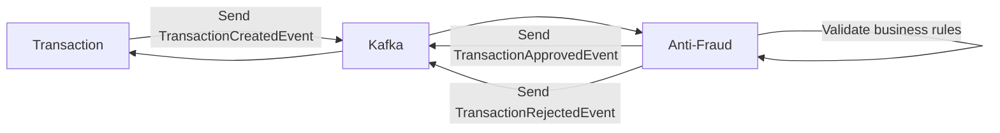

# Antifraud Service – Yape Code Challenge

Este proyecto implementa el **microservicio de Anti-Fraude**, desarrollado con **Spring Boot 3 – WebFlux**, siguiendo el enfoque de **Arquitectura Hexagonal (Ports & Adapters)** y un **flujo event-driven basado en Kafka**.

El servicio **no expone endpoints REST** y opera **100% de forma asíncrona**, reaccionando a eventos de transacciones creadas y emitiendo eventos con el resultado de la validación antifraude.

Todos los mensajes intercambiados utilizan **JSON** y el servicio está preparado para ejecutarse **localmente mediante Docker Compose**.

---

## Problem

Cada vez que se crea una transacción financiera, esta debe ser evaluada por el microservicio de **Anti-Fraude** para determinar si es válida o no.

Actualmente se manejan los siguientes estados de transacción:

* pending
* approved
* rejected

**Regla de negocio:**
Toda transacción con un valor **mayor a 1000** debe ser **rechazada**.



---

## Arquitectura

El proyecto sigue **Arquitectura Hexagonal**, separando claramente el dominio, la aplicación y la infraestructura.

```
├── application
│   ├── dto
│   ├── service
│   └── usecase
├── domain
│   ├── model
│   └── port
├── infrastructure
│   ├── inbound
│   │   └── kafka
│   ├── outbound
│   │   └── kafka
│   └── config
```

### Principios aplicados

* Arquitectura Hexagonal (Ports & Adapters)
* Event-Driven Architecture
* Programación Reactiva (Mono / Flux)
* Idempotencia en consumo de eventos
* Configuración externalizada
* Pruebas unitarias enfocadas en reglas de negocio

---

## Ejecución local (sin Docker)

### Requisitos

* Java 17
* Maven 3.9+
* Kafka + Zookeeper

### Compilar y ejecutar tests

```bash
mvn clean compile
mvn test
mvn verify
```

Reporte JaCoCo:

```
target/site/jacoco/index.html
```

---

## Integración con Transaction Service

El **Antifraud Service** no recibe llamadas HTTP directas.

### Flujo de eventos

1. Transaction Service publica `TransactionCreatedEvent`
2. Antifraud Service consume el evento
3. Se evalúan reglas antifraude
4. Se publica:

    * `APPROVED` o
    * `REJECTED`
5. Transaction Service consume el evento y actualiza el estado

---

## Docker Compose

El servicio se levanta automáticamente como parte del ecosistema completo.

### Puertos

* Antifraud Service → **8081**
* Kafka → **9092**

> El puerto del servicio se utiliza únicamente para health checks y observabilidad.

---


## Empaquetar Antifraud y copiar el `.jar` a `devops/antifraud` al repositorio  **app-java-codechallenge**

## Levantar el entorno completo


Desde el repositorio **app-java-codechallenge**, dentro del directorio `devops`:

```bash
./up_all_services.sh
```

Si tienes problemas de permisos:

```bash
chmod +x up_all_services.sh
```

### Windows

```bash
sh up_all_services.sh
```

---

## Logs y monitoreo

Ver contenedores activos:

```bash
docker ps
```

Ver logs del servicio antifraud:

```bash
docker compose logs -f antifraud-service
```

---

## Stack Tecnológico

* Java 17
* Spring Boot 3.5 (WebFlux)
* Project Reactor (Mono / Flux)
* Kafka
* Arquitectura Hexagonal
* Event-Driven Architecture
* Docker & Docker Compose
* JUnit 5 & Mockito
* JaCoCo

---
